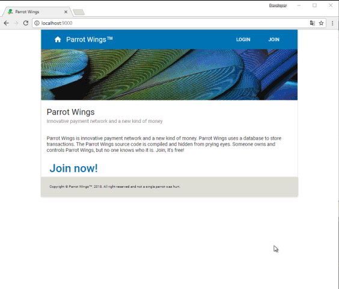

# Parrot Wings

[](https://www.visualstudio.com/)
[](https://www.asp.net)
[](https://nodejs.org/)
[](https://reactjs.org)
[](https://webpack.js.org)
[](https://github.com/meet-aleksey/GradientColorPicker/blob/master/LICENSE)

This is a demonstration of the skills of creating a web application using ASP.NET and React.



The application is for Parrot Wings (PW, "internal money") transfer between system users.

The application consists of two parts:

1. Web API - ASP.NET
2. The client site - react-application.

On the server side implemented user authentication mechanism, money transfers between users 
of the system and maintenance of payment history.

On the client side is implemented user interface for users registration and authentication, 
user profile page and the functionality to perform money transfer to system participants.

The project was created from scratch in about 24 hours.

Some of the solutions used are new to me.

## Technologies and libraries used

### Tools

* Visual Studion 2017
* Node.js v8.9.1

### Backend

* ASP.NET (.NET Framework v4.6), C#
* EntityFramework 6
* AspNet Identity
* Owin
* Newtonsoft.Json
* AutoMapper

### Databse

* SQL Server LocalDB

### Frontend

* TypeScript v2.7
* webpack v4.1
* react v16.2
* react-router v4.2
* material-ui v0.20
* and much more

## How to use

Download or clone (`git clone https://github.com/meet-aleksey/raptors-wing.git`) this repository to your computer.

Run the command line, go to the **ParrotWings.Web** project folder (`cd path to the project folder`)
and run the following commands:

```
npm install
npm run start:dev
```

If all goes well, the site will automatically open in the browser.

## Answers to questions that may arise

### EPERM: operation not permitted, scandir...

Try installing (`npm install`) with administrator rights.

### Module not found: Error: Can't resolve './Startup'

TypeScript files were not compiled for some reason.

Make sure that you have the correct TypeScript installed (the project was created for TypeScript v2.7).

```
C:\ParrotWings\ParrotWings.Web>tsc --version
Version 2.7.2
```

### MSBuild not found

If you get this error, then the server part probably will not work.

There are two ways to solve the problem:

1. Open and build the **ParrotWings.Api** in Visual Studio.

2. Fix the path to MSBuild in the `webpack.config.js` file.

### MSBuild: build failed

Open and build the **ParrotWings.Api** in Visual Studio.

Remove building code from `webpack.config.js`.

```
execSync(`"${msbuildPath}" "${root('../ParrotWings.Api/ParrotWings.Api.csproj')}" /p:VisualStudioVersion=14.0`);
```

Or you can fix this code to suit your system.

### IIS Express not found

ASP.NET requires IIS Express.

It is expected that Express is located in the folder `C:\Program Files (x86)\IIS Express\iisexpress.exe`.

You can fix the path in the `package.json` file, please see `env.programFiles86`:

```
"scripts": {
  "build:dev": "tsc && webpack --mode development --progress --env.programFiles86=\"%PROGRAMFILES(X86)%\" --env.system=\"%SYSTEMROOT%\"",
  "build:prod": "tsc && webpack --mode production --progress --env.programFiles86=\"%PROGRAMFILES(X86)%\" --env.system=\"%SYSTEMROOT%\"",
  "start:dev": "tsc && webpack-dev-server --env.programFiles86=\"%PROGRAMFILES(X86)%\" --env.system=\"%SYSTEMROOT%\""
},
```

### Cannot find file "applicationhost.config"

Just open the project in Visual Studio and run (key F5) **ParrotWings.Api**.

### Cannot attach the file *.mdf as database

Try:

```
sqllocaldb stop
sqllocaldb delete
```

### Why is the repository name "raptors-wing"?

**Raptor's Wing** - this is anagram of **Parrot Wings**.

## License

This project is licensed under the MIT License - see the [LICENSE](LICENSE) file for details.

Copyright © 2018, [@meet-aleksey](https://github.com/meet-aleksey)